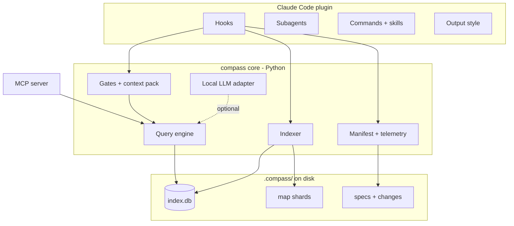
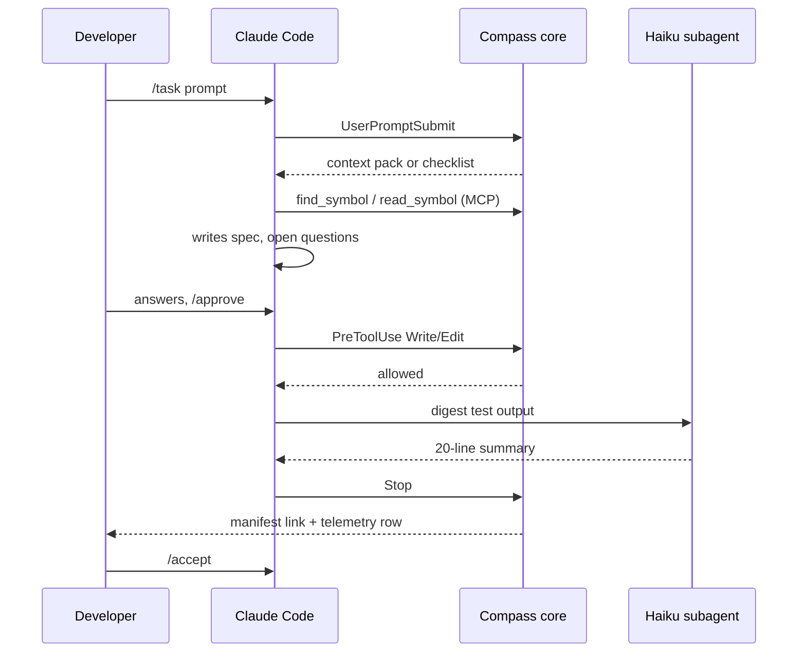

# Compass — Architecture & Technical Design

Sep 23, 2026 · @Uvesh

## Architecture overview

Compass has three layers: a thin plugin that Claude Code loads, a local Python core that does all the work, and on-disk state under `.compass/`. The plugin holds no logic; every hook and tool calls into the core.



Keeping logic in the core means the same code serves Claude Code hooks, the MCP server, the developer's CLI and CI. It also keeps Compass portable to other agents later, since only the thin plugin layer is Claude Code specific.

## Request lifecycle

A large task passes through five Compass touchpoints between the developer's prompt and an accepted change. Small tasks skip the spec steps.



The main model never sees raw test logs or whole files it only needed to locate things in.

## Execution tiers and routing

Every piece of work goes to the lowest tier that can do it correctly. Most savings come from Tier 0, because work that never reaches a model costs nothing.

| Tier | Executor | Latency | Handles | On the critical path? |
| --- | --- | --- | --- | --- |
| 0 | Scripts (core) | ms | Index, lookups, range reads, trees, manifests, gates | Yes |
| 1 | Local LLM | seconds | Summaries for undocumented symbols, bulk classification | No, background only |
| 2 | Haiku subagent | seconds | Digesting logs, tests and large files; mechanical edits from a spec | Yes, when input is large |
| 3 | Main model | normal | Design, logic, judgment, anything ambiguous | Yes |

### Routing rules

1. A question about where or what something is goes to Tier 0 query tools first.
2. Input over about 500 lines with a short expected output goes to Tier 2.
3. Work that needs judgment, or is under about 50 lines of input, stays in Tier 3; a subagent's fresh context would cost more than it saves.
4. Tier 1 is never awaited by a developer-facing step.

Rules 2 and 3 live in the CLAUDE.md fragment, which SessionStart prints, and in the subagent descriptions, since the main model makes the delegation call. Compass enforces what comes back: the SubagentStop hook sends an answer that breaks its subagent's output contract back once, and PreToolUse keeps the `scaffold` agent to the files it was given (DL-02).

## Data and storage layout

All state lives in one `.compass/` folder per repo. Team-owned inputs are committed; derived data is gitignored and can be rebuilt at any time with `compass index --full`.

| Path | Contents | Committed? |
| --- | --- | --- |
| `config.yaml` | Module toggles, gate rules, budgets, local-LLM settings | Yes |
| `standards/` | Team standards skills per stack | Yes (or linked from an org repo) |
| `specs/<id>.md` | Task specs with status and open questions | Team choice; recommended yes |
| `index.db` | SQLite: files (with a test-file flag), symbols, imports resolved to files, call sites | No |
| `map/` | Markdown shards per directory + `_index.md` | No |
| `changes/<id>.md` | Change manifests, each with a `.json` twin | No; moved to `changes/archive/` on `/compass:accept` |
| `state.json` | Active task id and size, each task's brief, touched files and spec approval, per-session turn state, the scaffold subagent's delegated files and edits | No |
| `stack.json`, `config.cache.json`, `llm.json` | Caches for the hooks: the stack summary from SessionStart, the parsed config, the local model's last health check | No |
| `summaries.db` | Local-model summaries of undocumented symbols, keyed by content hash (`compass enrich`) | No; kept by `compass index --full`, since only the local model can rebuild it |
| `telemetry.jsonl` | One row per task | No |
| `logs/` | Hook errors (`errors.log`) and every prompt-gate decision, bypasses included (`gate.jsonl`) | No |

Shards are derived and fast to regenerate, so there is no reason to commit them and create merge conflicts.

## Configuration

One YAML file controls everything. Defaults favour adoption: gates warn rather than block, and every module can be switched off.

```yaml
# .compass/config.yaml
version: 1

prompt_gate:
  enabled: true
  strictness: warn          # off | warn | block
  bypass_prefix: "!quick"
  required_fields: [goal, scope, acceptance]

context_pack:
  enabled: true
  token_budget: 1500

spec_gate:
  enabled: true
  large_task_when:
    files_mentioned_gte: 3
    keywords: [refactor, migrate, redesign, "new module"]

index:
  exclude: ["**/generated/**", "**/*.min.js", "**/*.min.css", "**/*.js.map", "vendor/**",
            "**/*.lock", "**/package-lock.json", "**/pnpm-lock.yaml", "**/bun.lockb",
            "**/go.sum", "**/Package.resolved"]   # lockfiles: the stack profile reads them directly
  max_file_kb: 1024
  shard_token_limit: 2000

query:
  max_response_chars: 4000  # longer MCP answers end with a cursor (QT-05)
  context_lines: 3          # lines around a symbol in read_symbol (QT-02)

review:
  enabled: true
  require_anchors: true     # the Stop hook sends Claude back once to tag untagged changes
  reply_max_lines: 10
  anchor_exempt: ["**/*.json", "**/*.lock", "**/*.svg"]   # files that cannot hold comments (shortened)

delegation:
  enabled: true
  digest_threshold_lines: 500  # hand reading this much to a subagent when the answer is short
  enforce_contracts: true      # a subagent whose answer breaks its contract is sent back once

local_llm:
  enabled: false
  base_url: http://localhost:11434/v1  # loopback only: code never leaves the machine (NF-10)
  model: qwen2.5-coder:7b
  timeout_s: 30
  enrich_limit: 200            # symbols `compass enrich` summarises per run

telemetry:
  enabled: true
  export: false
```

The model name above is only an example; pick whatever runs well on the team's hardware.

## Extension points

Stack-agnosticism depends on these extension points being small and data-driven, so adding support never touches core code.

| To add | You provide | Where |
| --- | --- | --- |
| A language | A `language.yaml` (grammar, file matching, docstring, visibility, test and import-resolution rules), a `tags.scm` query (definitions and call sites) and an optional import query | `src/compass/queries/<lang>/` |
| A stack detector | A module with a `detect(repo) -> dict \| None` function reading one manifest type | `src/compass/stacks/` |
| A prompt-gate rule | A function `(prompt, config) -> list[missing_field]` | `src/compass/gate/rules/` |
| A test-mapping convention | Test-file globs and name affixes, e.g. `x.test.ts` tests `x.ts` | The language's `language.yaml` (`tests:` section) |
| A subagent | A Markdown file with frontmatter and an output contract | `plugin/agents/` |
| A team standard | A skill folder | `.compass/standards/` or the org repo |

Every new language must come with a fixture repo and snapshot test before it counts as supported.

Hosting services follow the same pattern. GitHub Actions, Azure Pipelines and GitLab CI each have their own stack detector, and anything else tied to a hosting service, such as links to hosted views or distribution, must support both GitHub and Azure DevOps (NF-16). Everything that touches version control goes through plain git, so git hooks and file enumeration already behave the same on Azure Repos as on GitHub.

## Failure modes

Compass must never make Claude Code worse than stock. Any failure other than a deliberate gate decision exits 0 and logs to `.compass/logs/`.

| Failure | Behaviour | User sees |
| --- | --- | --- |
| Hook raises an exception | Exit 0, error logged | Nothing; session continues |
| Index missing or corrupt | SessionStart triggers a rebuild in the background; query tools answer "index not ready" | One-line notice |
| Hook exceeds its time budget | Context pack returns what it has so far | Smaller context pack |
| Local LLM unreachable | Local features disabled for the session; `compass enrich` does nothing | Nothing |
| Subagent answer breaks its contract | SubagentStop sends it back once with the reason; the retry always passes | A slightly longer delegation |
| `scaffold` edits a file it was not given | PreToolUse refuses the edit and names the allowed files; the agent reports back | The subagent's report names the file |
| Stop hook would block twice in a row | Second block skipped (`stop_hook_active` check, plus Compass's own record of its last block) | Normal stop |
| `compass` CLI not installed but the plugin is | Each hook command fails to start; Claude Code treats that as a non-blocking error | A hook error notice; session continues |
| Pre-commit check fails internally | Commit allowed, error logged | Nothing |
| Spec gate blocks a genuinely small edit | Developer runs `!quick` or `/approve` | Clear message naming the fix |
| Config file invalid | Defaults used; warning printed once per session | One-line warning |

## Architecture decision records

All eight decisions are proposed for review before M1 starts. New decisions get the next ADR number and one row here; a superseded ADR stays listed with its replacement noted.

| ADR | Decision | Why | Trade-off accepted | Status |
| --- | --- | --- | --- | --- |
| 001 | Build as a Claude Code plugin, not a wrapper CLI | Uses supported extension points; survives Claude Code updates | Limited to what hooks, subagents and MCP expose | Proposed |
| 002 | tree-sitter for parsing, universal-ctags as fallback | One parser framework covers 100+ languages; incremental and robust to syntax errors | Tags queries must be maintained per language | Proposed |
| 003 | SQLite as source of truth, Markdown shards as the LLM view | Fast structured queries plus token-cheap reading | Two representations to keep in sync | Proposed |
| 004 | Python for v1 | Fastest to build; mature tree-sitter and MCP bindings | Start-up time and packaging; revisit Go or Rust for hot paths after the pilot | Proposed |
| 005 | Local LLMs via MCP tools, not by remapping a model tier through a gateway | Small local models are unreliable at agentic tool calling; tools only need plain completions | No local model for interactive agent turns | Proposed |
| 006 | Deterministic rules for the prompt gate | Must run under 100 ms on every prompt with no token cost | Rules are cruder than an LLM judge; tuned from logs | Proposed |
| 007 | Anchor tags in code, stripped before commit | Reviewers see marks in context in any editor; no editor plugin needed | Extra comment noise until `/accept` | Proposed |
| 008 | stdio-only MCP server | No open ports; nothing reachable from the network | One server process per Claude Code session | Proposed |
