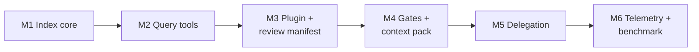

# Compass — Getting Started: Development Guide

Sep 23, 2026 · @Uvesh

## Build order and milestones

Build the deterministic core first. The code map and query tools cut tokens by themselves, and every later feature depends on them.



| Milestone | Steps | Done when | Est. effort |
| --- | --- | --- | --- |
| M1 Index core | 0–3 | `compass index` builds SQLite + shards for fixture repos in 4 languages; incremental update under 500 ms | 2 weeks |
| M2 Query tools | 4 | Claude Code answers "where is X" through MCP with no Read calls | 1 week |
| M3 Plugin + review | 5–6 | Plugin installs locally; every AI change produces a manifest | 1 week |
| M4 Gates | 7 | Vague prompts get a checklist; large tasks need an approved spec | 1.5 weeks |
| M5 Delegation | 8 | Digest and test-runner subagents in use; local-LLM enrichment optional | 1 week |
| M6 Measurement | 9 | Benchmark produces an on/off comparison report | 0.5 weeks |

Tip: turn on telemetry (Step 9, first bullet) early, even before M6. Baseline data from your own sessions is worth more than any estimate.

## Step 0: Prerequisites and repo skeleton

Set up one Python package that provides the `compass` CLI and the MCP server, next to a plugin folder that Claude Code installs.

### Install

- Python 3.11+ and [uv](https://docs.astral.sh/uv/) for dependency management
- git, and optionally universal-ctags
- Claude Code, latest release
- Optional: Ollama or LM Studio for Step 8

### Layout

```
compass/
├── pyproject.toml
├── .github/workflows/ci.yml  # CI on GitHub Actions ...
├── azure-pipelines.yml     # ... and on Azure Pipelines; kept identical (NF-16)
├── src/compass/
│   ├── cli.py              # `compass` entry point (argparse)
│   ├── files.py            # file enumeration, hashing
│   ├── languages.py        # language registry from queries/<lang>/language.yaml
│   ├── stack.py            # stack profile; one detector module per stack in stacks/
│   ├── hooks.py            # `compass hook <event>` entry point
│   ├── githooks.py         # post-commit/checkout/merge/rewrite hooks for `compass init`
│   ├── index/
│   │   ├── parser.py       # tree-sitter tags queries
│   │   ├── ctags.py        # universal-ctags fallback
│   │   ├── docs.py         # doc-comment attachment
│   │   ├── store.py        # SQLite schema and queries
│   │   ├── shards.py       # Markdown map shard writer
│   │   ├── resolve.py      # import targets -> repo files
│   │   └── indexer.py      # full builds, stat-based refresh, per-file updates
│   ├── queries/            # per language: language.yaml, tags.scm, imports.scm
│   ├── stacks/             # stack detectors: detect(repo) -> dict | None
│   ├── query.py            # the query engine behind the MCP tools and CLI twins
│   ├── mcp_server.py       # MCP tools over the index
│   ├── manifest.py         # anchor scan + change manifest
│   ├── gate.py             # prompt gate + context pack
│   └── telemetry.py
├── plugin/                 # the Claude Code plugin
│   ├── .claude-plugin/plugin.json
│   ├── hooks/hooks.json
│   ├── agents/             # digest.md, scaffold.md, test-runner.md
│   ├── commands/           # task.md, approve.md, accept.md
│   ├── skills/
│   └── .mcp.json
├── tests/fixtures/         # small repos in 4+ languages
└── bench/                  # benchmark tasks (see Evaluation plan)
```

### Core dependencies

```toml
[project]
name = "compass"
requires-python = ">=3.11"
dependencies = [
  "tree-sitter==0.25.2",
  "tree-sitter-language-pack==0.13.0",
  "pyyaml",
  "mcp>=2.2,<3",   # SDK v2: MCPServer (v1's FastMCP was renamed)
]
[project.scripts]
compass = "compass.cli:app"
```

Pin the two tree-sitter packages together. Language-pack 1.x downloads grammars at runtime, which would put network calls on hook paths and break offline machines; 0.13.0 is the last release that bundles them in the wheel. The CLI uses argparse: every hook starts a `compass` process, and Typer's import alone costs about a quarter of the prompt gate's 100 ms budget.

**Done when:** `uv run compass --help` works and CI runs an empty test suite on macOS, Linux and Windows, on both GitHub Actions and Azure Pipelines (NF-16).

## Step 1: File enumeration and stack profile

Start with the two cheapest, most reusable pieces: a reliable file list with content hashes, and a stack profile read from manifest files.

### File enumeration

1. Run `git ls-files -co --exclude-standard` to get tracked plus untracked-but-not-ignored files.
2. Apply the exclude list from `.compass/config.yaml` (lockfiles, generated code, vendored folders, binaries).
3. Detect language by extension first, then shebang; skip files above a size cap (default 1 MB).
4. Hash contents with `hashlib.blake2b` and store `path, lang, size, hash, mtime`.

### Stack profile

Read manifest files, never source code. Output a small JSON document that is injected at session start.

| Manifest | Gives you |
| --- | --- |
| `package.json` + lockfile | Node/TS frameworks, versions, `scripts` for build/test/lint |
| `pyproject.toml`, `requirements*.txt` | Python deps, tool config (pytest, ruff) |
| `go.mod` | Go version and modules |
| `Cargo.toml` | Rust crates and edition |
| `pom.xml`, `build.gradle(.kts)` | JVM deps, Kotlin/Java, Android |
| `pubspec.yaml` + `pubspec.lock` | Dart/Flutter deps |
| `*.csproj` | .NET target and packages |
| `Package.swift`, `Podfile` | Swift deps |
| `Dockerfile`, CI configs (GitHub Actions, Azure Pipelines, GitLab CI) | Runtime images, real test commands |

Keep detectors as small plugins (`detect(repo) -> dict | None`), so adding a stack never touches core code.

**Done when:** `compass files` and `compass stack --json` work on all fixture repos.

## Step 2: Code map indexer

The indexer turns every source file into symbol rows in SQLite, then writes one Markdown shard per directory. No LLM is involved.

### 2a. Tags queries

Each language needs a `tags.scm` query that captures definitions. Many grammar repos ship one, and Aider's repo-map feature maintains a broad set; check their licenses before vendoring. A minimal Python example:

```scheme
(class_definition name: (identifier) @name.definition.class) @definition.class
(function_definition name: (identifier) @name.definition.function) @definition.function
```

The outer capture gives the line range; the `@name.*` capture gives the name and kind.

### 2b. Parser

```python
from tree_sitter_language_pack import get_parser, get_language

def extract(path: str, lang: str, src: bytes) -> list[Symbol]:
    tree = get_parser(lang).parse(src)
    query = load_tags_query(lang)          # from src/compass/queries/
    # py-tree-sitter's query API changed across versions
    # (Query.captures vs QueryCursor); pin one version and wrap it here.
    for node, capture in run_query(query, tree.root_node):
        if capture.startswith("definition."):
            yield Symbol(
                kind=capture.split(".", 1)[1],
                name=name_of(node),
                start=node.start_point[0] + 1,
                end=node.end_point[0] + 1,
                signature=first_line(src, node),
                parent=enclosing_definition(node),
                doc=attach_doc(node, src, lang),
            )
```

For files with no grammar, run `ctags --output-format=json` and map its fields to the same `Symbol` shape.

### 2c. Doc-comment attachment

1. Walk back through `node.prev_sibling` while the siblings are comment nodes.
2. Stop at the first blank line or non-comment node.
3. Strip comment markers (`//`, `#`, `/** */`, `///`, `--`).
4. Per-language overrides: Python and Elixir take the first string in the body; Go keeps the leading comment as usual.
5. Store the full text; the shard uses only the first sentence, capped at 120 characters.

### 2d. SQLite schema

```sql
CREATE TABLE meta (key TEXT PRIMARY KEY, value TEXT) WITHOUT ROWID;  -- index fingerprint
CREATE TABLE files (
  path TEXT PRIMARY KEY, dir TEXT, lang TEXT, hash TEXT, size INT, mtime_ns INT,
  doc TEXT                                  -- file header / README summary (IX-09)
);
CREATE TABLE symbols (
  id INTEGER PRIMARY KEY, path TEXT REFERENCES files(path) ON DELETE CASCADE,
  name TEXT, kind TEXT, parent TEXT, signature TEXT,
  start_line INT, end_line INT, visibility TEXT,
  doc TEXT, doc_source TEXT CHECK (doc_source IN ('author','generated'))
);
CREATE INDEX symbols_name ON symbols(name);
CREATE TABLE imports (path TEXT REFERENCES files(path) ON DELETE CASCADE, target TEXT,
                      PRIMARY KEY (path, target)) WITHOUT ROWID;
CREATE TABLE skipped (path TEXT PRIMARY KEY, size INT, mtime_ns INT) WITHOUT ROWID;
```

Store no timestamps other than file mtimes, and insert everything in sorted order, so a fresh build of the same tree is byte-identical (NF-13). `skipped` remembers binaries and oversized files so refreshes do not re-read them.

### 2e. Map shards

One file per directory at `.compass/map/<dir>.md` (the repo root is `_root.md`), plus `.compass/map/_index.md` listing directories with file and symbol counts and each folder's purpose from its README or index-file header (IX-09). Split a shard when it passes 2,000 tokens; the parts continue in `<dir>~2.md`, `<dir>~3.md` and so on. Write shards inside the same SQLite transaction as the rows they show, so a failed write rolls back and the two representations never drift apart.

```markdown
# src/transport/  (4 files, 23 symbols)
## reconnect.ts
- L12  class ReconnectPolicy — Retry strategy for dropped connections
- L30    method next(attempt: number): number — Delay in ms, exponential with jitter
- L71  fn withRetry<T>(op, policy): Promise<T> ~ Wraps an async op with retries
```

`—` marks an author-written comment and `~` a generated summary. Sort everything so output is byte-identical for identical input.

**Done when:** `compass index` runs on all fixture repos and a snapshot test of every shard passes.

## Step 3: Incremental updates and triggers

With content hashes stored per file, every trigger calls the same function: re-index these paths if their hash changed, then rewrite only the affected shards.

```python
def update(paths: list[str]) -> None:
    for p in paths:
        new = hash_file(p) if exists(p) else None
        if new == store.hash_of(p):
            continue
        store.delete_file(p)            # cascades to symbols
        if new:
            store.insert(p, extract(p))
    shards.rewrite(dirs_of(paths))
```

### Triggers

| Trigger | Mechanism | Paths |
| --- | --- | --- |
| Claude edits a file | `PostToolUse` hook, matcher `Write\|Edit` | `tool_input.file_path` from the hook's stdin JSON |
| Commit, checkout, merge, pull, rebase | git `post-commit`, `post-checkout`, `post-merge`, `post-rewrite` hooks | Size-and-mtime check of all files; re-hash the ones that moved |
| Session starts | `SessionStart` hook | Hash check of all files; re-index stale ones |
| Manual | `compass index [--full]` | All, or changed only |
| Edits outside Claude (optional) | `compass watch` using `watchfiles` | Debounced changed paths |

Git hooks call `compass update --from-git`. `compass init` installs them and chains to any existing hooks rather than overwriting them; a hook that dispatches on its own file name (husky 4, overcommit) is left alone and `init` prints the line to add. The stat check catches everything git does to the working tree, including resets and stash pops, so there is no need to diff HEADs. Large changes (a branch switch touching hundreds of files) are handed to a background process so the git command returns at once.

**Done when:** editing one file updates its shard in under 500 ms, and switching branches leaves no stale symbols.

## Step 4: Query tools (MCP server and CLI)

Expose the index through a stdio MCP server, and give every tool a CLI twin so the same logic serves Claude, developers and CI.

```python
from mcp.server.mcpserver import MCPServer   # MCP SDK v2; v1 called it FastMCP
from mcp.types import ToolAnnotations

server = MCPServer("compass", instructions=INSTRUCTIONS)
READ_ONLY = ToolAnnotations(readOnlyHint=True, idempotentHint=True, openWorldHint=False)

@server.tool(annotations=READ_ONLY, structured_output=False)
def find_symbol(name: str, kind: str | None = None, path: str | None = None, cursor: int | str | None = None) -> str:
    """Find where a class, function or method is defined. Use this instead of Grep or Glob."""
    return answer(lambda q: q.find_symbol(name, kind, path), cursor)

# also: read_symbol, file_outline, map, stack_profile, tests_for, importers_of, callers_of

server.run("stdio")
```

All behaviour lives in one query engine (`compass/query.py`), and each tool has a CLI twin with the same name in kebab case (`compass find-symbol`, `compass callers-of`, …; `--json` for structured output). Answers are compact text in the map-shard format, `path:start-end  kind signature — doc`, because that costs far fewer tokens than JSON.

The tools need three things the M1 index lacked, all configured per language in `language.yaml`:

- **Call sites** (`@reference.call` captures in `tags.scm`), for `callers_of`.
- **Resolved imports**, for `importers_of`. Resolvers: `path` (JS, TS, including tsconfig `paths` and `baseUrl`), `module` (Python, Rust) and `package` (Go, via `go.mod`). `from pkg import models` points at `pkg/models.py`, not the package, and a stray `scripts/os.py` must not capture every `import os`.
- **Test files and naming conventions** (`test_x.py`, `x.test.ts`, `x_test.go`, Rust inline `mod tests`), for `tests_for`.

The server must also keep the index fresh by itself. Edits made through Bash or an editor never reach the Claude Code hooks, so every tool runs SessionStart's staleness check at most every 20 s, and a tool about one file re-indexes it first if it changed on disk. `read_symbol` and `file_outline` take line numbers from the file as it is now, since the index can lag behind (another process may hold its lock). Until the first build commits, tools answer "being built" rather than empty results.

The SDK runs tool calls on worker threads, so the engine must be safe to share: one SQLite connection per call and a lock around tree-sitter parsing. Adding or deleting a file re-resolves every import inside the post-edit hook, so resolution has to share work across rows to stay within NF-04.

Register it in the plugin's `.mcp.json`:

```json
{ "mcpServers": { "compass": { "command": "compass", "args": ["mcp"] } } }
```

### Make Claude actually use it

- Tool descriptions state when to prefer them over Read, Grep and Glob; the model follows descriptions closely.
- One rule goes in the server's `instructions` (and, from M3, the plugin's CLAUDE.md fragment): look up symbols through Compass tools, and read whole files only when editing them.
- Cap every response (default 4,000 characters, `query.max_response_chars`, cursor line included) and end a longer one with a `cursor` to continue. Accept the cursor as a number or a string: models send both.

**Done when:** in a test session, "where is retry handled and what calls it?" is answered with Compass tools and zero Read calls.

## Step 5: Plugin scaffold and local install

The plugin is plain files: a manifest, a hooks config, subagent and command Markdown files, an optional output style, and the MCP registration from Step 4. Check field names against the current [Claude Code plugin docs](https://docs.claude.com/en/docs/claude-code/overview) before each release, since the plugin format still evolves. `claude plugin validate --strict plugin` checks the files locally, with no model call; CI validates them against SchemaStore's schemas.

### plugin.json

```json
{
  "name": "compass",
  "version": "0.1.0",
  "description": "Prompt gates, code map, delegation and review manifests for Claude Code"
}
```

### hooks/hooks.json

```json
{
  "hooks": {
    "SessionStart":     [{ "hooks": [{ "type": "command", "command": "compass hook session-start", "timeout": 30 }] }],
    "UserPromptSubmit": [{ "hooks": [{ "type": "command", "command": "compass hook prompt", "timeout": 10 }] }],
    "PostToolUse": [{ "matcher": "Write|Edit|MultiEdit|NotebookEdit",
                      "hooks": [{ "type": "command", "command": "compass hook post-edit", "timeout": 30 }] }],
    "Stop":             [{ "hooks": [{ "type": "command", "command": "compass hook stop", "timeout": 30 }] }]
  }
}
```

Route every hook through one `compass hook <event>` entry point. It reads JSON from stdin, dispatches, catches all exceptions and exits 0 on internal errors, so Compass always fails open. Set a `timeout` on each: the default is ten minutes, and a hung hook would stall the session that long. Add `PreToolUse` with the spec gate (Step 7); until then it would only start a process on every edit.

### A subagent: agents/digest.md

```markdown
---
name: digest
description: Summarise large files, logs or test output. Use PROACTIVELY for any input over 500 lines.
tools: Read, Grep, Glob, Bash
model: haiku
---
Return at most 30 lines. Every claim cites file:line. No code blocks longer than 5 lines.
If asked a question the input cannot answer, say so in one line.
```

### Install locally while developing

1. `uv tool install --editable .` puts `compass` on PATH, running your working copy.
2. `.claude-plugin/marketplace.json` at the repo root lists `./plugin`. Add it and install from it: `claude plugin marketplace add ./`, then `claude plugin install compass@compass-marketplace` (or `/plugin marketplace add` and `/plugin install` inside Claude Code). For a one-off session, `claude --plugin-dir ./plugin` loads it without installing.
3. After changing hooks or agents, reinstall or restart Claude Code, then run `/hooks`, `/agents` and `/mcp` to confirm they loaded.
4. Keep a scratch repo open in a second terminal for manual testing.

**Done when:** a fresh machine goes from clone to working plugin with `uv tool install .` and the two install commands.

### Distribute from GitHub or Azure DevOps (NF-16)

The team's repos may live on either host, so both distribution paths must work before release:

- **Plugin:** Claude Code accepts any git URL as a marketplace source, so `/plugin marketplace add` takes either `owner/repo` for GitHub or `https://dev.azure.com/<org>/<project>/_git/<repo>` for Azure Repos. Private repos authenticate through the user's git credential helper (Git Credential Manager on Windows). `--sparse .claude-plugin plugin` fetches only the plugin, not the whole source tree.
- **CLI package:** `uv tool install git+<repo URL>` works against either host. For a package feed, use PyPI or an Azure Artifacts Python feed; GitHub Packages has no Python registry.

## Step 6: Review manifest and anchor tags

Build this before the gates. It gives visible value on day one and needs only a scanner, a generator and two hooks.

### Anchor vocabulary

| Tag | Meaning | Reviewer action |
| --- | --- | --- |
| `@ai:change <id>` | Mechanical change | Skim |
| `@ai:assume <id>` | Assumption not verified | Confirm or correct |
| `@ai:review <id>` | Judgment call | Read carefully |
| `@ai:todo <id>` | Deliberately left undone | Decide |

Write tags in the file's own comment syntax. The scanner matches `@ai:(change|assume|review|todo)\s+(\S+)\s*[—-]?\s*(.*)` on any line, so it needs no per-language logic. Two refinements keep documentation from counting as tags: the id must start and end with a letter or digit (so `<id>` placeholders never match), and a tag right after a backtick is a Markdown code span quoting one.

Until M4's `/task` exists, tasks are implicit: the first time Compass needs an id it starts `T<n>` in `.compass/state.json`, and that task stays active until it is accepted.

### Pieces to build

1. **Reply rules** telling Claude to: tag every change, keep the chat reply to about 10 lines, and link the manifest instead of pasting code. The SessionStart hook injects them with the active task id and `review.reply_max_lines`, so config can switch them off; the same rules ship as an opt-in output style. A forced plugin style would override the developer's own style with no way to turn it off.
2. **`compass manifest <id>`** scans anchors plus `git diff`, then writes `.compass/changes/<id>.md` grouped into Review, Assumptions, TODO and Mechanical, each line as `path:line — note` linking to the line. `--hosted` prints the same page with links into GitHub or Azure DevOps (NF-16), for a pull request.
3. **Stop hook**: if files changed this turn but have no anchors, answer `{"decision": "block", "reason": …}` so Claude adds them. Exempt files that cannot hold comments (`review.anchor_exempt`: JSON and the like), binaries and edits that were undone. The hook also rewrites the manifest, so it is never missing.
4. **`/compass:accept <id>`** command: strips that task's anchors and archives the manifest, with line numbers moved to where the code sits once standalone tag lines are gone. Only the developer can run it (`disable-model-invocation`).
5. **Pre-commit git hook**: blocks any commit that adds a tag. It checks only the lines the commit adds, so a tag quoted in an already committed file never blocks later commits.

Guard the Stop hook against loops: check `stop_hook_active` in the hook input and never block twice in a row.

**Done when:** a real task produces a manifest, and a commit with leftover tags is rejected.

## Step 7: Prompt gate, context pack and spec gate

All three run in hooks, so they must be pure Python over the index with no network calls. Measure latency from the first commit.

### Prompt gate + context pack (UserPromptSubmit)

For this event, exit code 2 blocks the prompt and shows stderr to the user, while stdout on exit 0 is added to Claude's context.

```python
def on_prompt(evt: dict) -> int:
    prompt = evt["prompt"]
    cfg = load_config()
    if prompt.startswith(cfg.bypass_prefix):
        log_bypass(evt); return 0

    missing = [f for f in cfg.required_fields if not has_field(prompt, f)]
    if missing and cfg.strictness == "block":
        sys.stderr.write(checklist(missing)); return 2

    pack = build_context_pack(prompt, budget=cfg.pack_tokens)  # map lines, stack, tests
    if missing:                                                 # warn mode
        pack += f"\n[compass] Prompt is missing: {', '.join(missing)}. Ask before assuming."
    print(pack); return 0
```

`has_field` starts as simple rules: a `Goal:` label or an imperative first sentence, a path or symbol for scope, a `when` or `should` clause for acceptance. Refine the rules from the bypass log, not guesses.

`build_context_pack` extracts candidate names (backticked text, path-like tokens, CamelCase and snake\_case words), looks them up in SQLite, and emits the matching shard lines and `tests_for` results.

### Spec gate (PreToolUse on Write|Edit)

1. `/task` writes `.compass/state.json` with the active task id and size (small or large).
2. For large tasks, Claude writes `.compass/specs/<id>.md` from a template with Goal, Scope, Non-goals, Acceptance, Open questions, and `status: draft`.
3. The pre-edit hook exits 2 with "Spec \<id> not approved; answer open questions first" while status is draft. Writes to the spec file itself are allowed.
4. `/approve <id>` sets `status: approved`, with approver and timestamp.

**Done when:** a vague prompt gets a checklist, and a large task cannot edit code until its spec is approved.

## Step 8: Delegation and local LLM adapter

Ship the Haiku subagents first, since they work for everyone. The local-LLM adapter is optional and must never sit on the path a developer waits on.

### Haiku subagents

| Agent | Tools | Output contract |
| --- | --- | --- |
| `digest` | Read, Grep, Glob, Bash | ≤ 30 lines, file:line refs |
| `test-runner` | Bash, Read | Failures only: test name, assertion, file:line, ≤ 20 lines |
| `scaffold` | Read, Write, Edit | Only files named in the spec; every change anchored `@ai:change` |

Add a delegation rule to the CLAUDE.md fragment: delegate when the input is over about 500 lines and the needed output is short. Tiny tasks stay inline because a subagent starts from an empty context.

### Local LLM adapter

1. Config: `local_llm.base_url` (e.g. `http://localhost:11434/v1` for Ollama), `model`, `timeout`.
2. Client: a plain OpenAI-compatible `/chat/completions` call over HTTP, with no SDK lock-in.
3. Health check at start-up; if unreachable, every local feature silently turns off.
4. MCP tools `summarize_file` and `classify_files` call the local model and return only the result.
5. Background job `compass enrich`: for symbols with no doc comment, generate a one-line summary, cache it by the symbol's content hash, and store it with `doc_source = 'generated'`.

Run `compass enrich` from the post-commit hook in the background (detached, low priority), never from a Claude Code hook.

**Done when:** test output over 500 lines reaches the main model as a short digest, and enrichment fills summaries without slowing commits.

## Step 9: Telemetry, benchmark, testing and CI

Without measurement, the token-saving claim stays a belief. Start collecting telemetry on your own sessions from week 1.

### Telemetry

1. The Stop hook receives `transcript_path`. Parse the JSONL and sum the `usage` fields on assistant messages: input, output, cache-creation and cache-read tokens.
2. Record wall-clock time from the first prompt to the last Stop, plus counts of tool calls by name (especially Read versus Compass tools).
3. Append one row per task to `.compass/telemetry.jsonl`. Subagent sessions have their own transcripts, so attribute them to the parent task.
4. `compass report` groups rows by `compass_enabled` and prints medians and deltas.

### Tests

| Layer | What to test | How |
| --- | --- | --- |
| Parser | Symbols and docs per language | Fixture repos + snapshot of extracted rows |
| Shards | Byte-stable output | Snapshot tests; run twice and diff |
| Hooks | Contract with Claude Code | Pipe recorded JSON to `compass hook <event>`; assert exit code, stdout, stderr |
| Latency | NF-01 to NF-04 | pytest-benchmark on a generated 100k LOC repo |
| End to end | Real Claude Code sessions | Headless `claude -p` runs of benchmark tasks, weekly |

### CI

- Defined twice, identically: `.github/workflows/ci.yml` for GitHub Actions and `azure-pipelines.yml` for Azure Pipelines (NF-16); `tests/test_ci_configs.py` fails if their matrices or commands drift apart, and validates both against their published schemas
- Must run on a free personal GitHub account: no organization-only features, superseded runs cancelled, root-doc-only pushes skipped, one macOS leg in private repos (macOS minutes cost about ten times Linux against the free 2,000 a month). Pin third-party actions to exact release tags; not every action publishes a moving major tag
- On Azure DevOps, projects are always private: the hosted free tier (one job at a time, 1,800 minutes a month) needs the organization linked to an Azure subscription, and one self-hosted agent is free without it
- Matrix: macOS, Ubuntu, Windows on Python 3.11 and 3.12
- On every push: unit, snapshot, hook-contract and latency tests
- Weekly: install the latest Claude Code and run the end-to-end suite, so breaking changes are caught before users hit them; schedule it on both systems (`on: schedule` in GitHub Actions, `schedules:` in Azure Pipelines)

### Conventions

- Every hook path catches all exceptions and fails open, except the deliberate gates.
- No network calls in hooks, except the optional local-LLM health check.
- Use Compass on its own repo from M2 onward. Dogfooding finds friction faster than any review.
