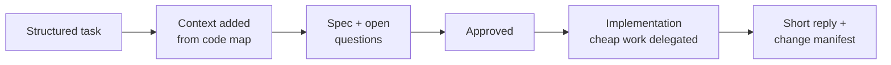

# Compass — Proposal for Adoption

Sep 23, 2026 · @Uvesh

## Summary

We propose building Compass, an internal layer on top of Claude Code, and piloting it with one team for 8 weeks. The pilot needs about 1 engineer for 6 to 8 weeks and no new infrastructure.

Compass makes AI-assisted work more predictable in three ways:

- **Better requests.** Developers provide structured tasks, and Compass automatically adds the relevant project context.
- **Fewer tokens.** Deterministic scripts and cheaper models handle lookups and bulk reading, so the main model spends its budget on design and logic.
- **Faster review.** Every AI change arrives with a short, linked manifest that separates judgment calls from mechanical edits.

The pilot either proves a 30% cut in main-model tokens with no loss of speed, or we stop. The decision requested is approval for the pilot and one pilot team.

## The problem

AI coding agents are already speeding up our work, but results vary widely between developers and tasks. The variation comes from how the tool is used, not from the model.

| Symptom | Effect on the team |
| --- | --- |
| Short, underspecified prompts | Plausible but wrong output, followed by several correction rounds |
| Agent starts editing before questions are answered | Rework, and changes outside the intended scope |
| Agent reads whole files and folders to find things | High token use and slower sessions; subscription users hit usage limits sooner |
| Model defaults to APIs from its training data | Code that doesn't match the versions and patterns we actually use |
| Long replies and large mixed diffs | Reviewers skim, and assumptions slip through unreviewed |
| Each developer has their own prompting habits | Standards differ between our teams in Ahmedabad, Italy and the US |

None of these is solved by a better model alone. They need a consistent process around the model, applied the same way for everyone.

## What Compass is

Compass is a Claude Code plugin plus a small local indexing tool. It works in any git repo, in any mainstream language, and needs no server.

Each step is enforced by Claude Code's own hooks, so developers keep their normal tools and workflow.

| Capability | What it does |
| --- | --- |
| Prompt gate | Asks for goal, scope, acceptance criteria and constraints before work starts |
| Code map | Script-built index of every file, class and function with its comment, kept current on each edit and commit |
| Spec gate | Blocks edits on larger tasks until open questions are answered and the spec is approved |
| Delegation | Sends log digestion, bulk reads and boilerplate to a cheaper model or a local model |
| Review manifest | Tags each change as mechanical, assumption or needs-review, with clickable file:line links |
| Standards pack | Injects our team rules and the dependency versions actually in the lockfile |
| Telemetry | Measures tokens and time per task, locally, so we can prove the effect |

## Expected benefits

The largest benefit is consistency: every developer's AI sessions follow the same disciplined process, whatever their prompting experience.

| Benefit | Who gains | How we will measure it | Pilot target |
| --- | --- | --- | --- |
| Fewer correction rounds | Developers | Follow-up prompts per accepted task | −25% |
| Lower token use | Company budget; subscription users hit fewer limits | Main-model tokens per task | −30% |
| Same or better speed | Developers, delivery leads | Wall-clock time per task | ≤ +5% |
| Faster, safer review | Reviewers, tech leads | Review minutes per AI change | −30% |
| Consistent standards across sites | Tech leads, architects | Standards violations found in review | Downward trend |
| Faster onboarding to unfamiliar repos | New joiners, cross-team contributors | Time to first merged change | Tracked, no target in pilot |
| Evidence for AI tooling decisions | Engineering management | Telemetry report | Report delivered |

All targets are hypotheses. The pilot measures them against a baseline recorded in the first two weeks.

## Cost and effort

The pilot costs about 7 engineer-weeks and no new infrastructure. These are initial estimates for one engineer and will be revised after the first milestone.

| Work package | Effort (engineer-weeks) |
| --- | --- |
| Code map indexer, map shards, query tools (MCP + CLI) | 3 |
| Review manifest, anchor tags, output style | 1 |
| Prompt gate, context pack, spec gate | 1.5 |
| Delegation subagents and optional local-LLM adapter | 1 |
| Telemetry, benchmark suite, pilot report | 0.5 |
| **Total build** | **7** |
| Pilot support (part-time, weeks 5 to 8) | 20% of one engineer |

### Running costs

- **Infrastructure:** none. Everything runs on developer machines.
- **Local LLM (optional):** runs on existing developer hardware or a shared workstation, if one is available.
- **Compass's own token overhead:** up to about 1,500 tokens of injected context per prompt, plus Haiku subagent calls. The benchmark measures this overhead as part of the net result.

### Savings model

Net monthly saving = current AI spend × measured token reduction − Compass overhead. We will fill in real figures from pilot telemetry rather than estimate them here. For seats on flat-rate subscriptions, the benefit shows up as fewer usage-limit interruptions rather than a lower bill.

## Alternatives considered

Building a thin layer on Claude Code's own extension points gives the most control for the least effort. Alternatives either enforce nothing or cost more to own.

| Option | Pros | Cons | Verdict |
| --- | --- | --- | --- |
| Do nothing | No effort | Variation, token waste and review load continue | Rejected |
| Guidelines doc + shared CLAUDE.md only | Cheap, quick | Advisory only; no enforcement, no indexing, no metrics | Adopted as a fallback and as part of Compass |
| Adopt existing open-source plugins and tools | Faster start | Fragmented; none combines gates, code map, delegation and review manifest; unknown maintenance | Reuse individual pieces where they fit |
| Wrapper CLI that proxies Claude Code | Full control of the I/O stream | Breaks with Claude Code updates; duplicates features Claude Code already has | Rejected |
| **Compass as a Claude Code plugin** | Uses supported extension points; incremental; each module can be switched off | We own the maintenance | **Recommended** |

## Risks and mitigations

The biggest risk is adoption, not technology. If the gates feel slow or preachy, developers will bypass or disable them.

| Risk | Likelihood | Impact | Mitigation |
| --- | --- | --- | --- |
| Developers find gates annoying and bypass them | High | High | Default to warn mode; `!quick` bypass; tune rules from the bypass log |
| Claude Code update breaks a hook or plugin feature | Medium | Medium | Only documented extension points; weekly CI against the latest release; every hook fails open |
| Token savings smaller than projected | Medium | Medium | Measure early (week 4 checkpoint); stop or narrow scope if below 15% |
| Cheaper-model output has errors | Medium | Medium | Delegate only reading and mechanical work; verify with linters and tests |
| Local LLMs too slow on developer hardware | Medium | Low | Local models only run in the background and are optional |
| Code or telemetry leaves company control | Low | High | All processing local; telemetry export opt-in; security review before any wider rollout |
| Maintenance burden after the pilot | Medium | Medium | Small modular codebase; a named owner; documented contribution guide |

## Pilot plan

The pilot runs 8 weeks with one team of 3 to 6 developers. It ends with a go, narrow or stop decision based on measured results.

| Weeks | Phase | Outcome |
| --- | --- | --- |
| 1–2 | Baseline + build core | Baseline metrics captured with telemetry only; code map and query tools working |
| 3–4 | Build gates and review | Prompt gate, spec gate, review manifest and delegation shipped to the pilot team |
| 4 | Checkpoint | Early token and speed numbers; stop if clearly failing |
| 5–7 | Pilot in daily use | Rules tuned weekly from bypass logs and feedback |
| 8 | Evaluate | Benchmark rerun, survey, pilot report, recommendation |

### Go / no-go criteria

- **Go (roll out to more teams):** tokens −20% or better, time ≤ +5%, and at least 70% of the pilot team still using it weekly
- **Narrow (keep only winning modules):** some modules clearly help, others don't
- **Stop:** tokens down less than 10%, or a speed regression above 10%

Pilot team candidates should work in at least two different stacks, to test the stack-agnostic claim.

## Decision requested

We ask for approval of the 8-week pilot, with about 7 engineer-weeks of build effort and one volunteer pilot team.

### Next steps after approval

- [ ] Confirm pilot team and repos (at least two stacks)
- [ ] Security and data-policy review of local processing and telemetry
- [ ] Confirm Claude Code plan and seat setup for the pilot team
- [ ] Name an owner for the shared standards pack
- [ ] Start baseline measurement in week 1

Supporting documents: Compass — Requirements Specification, Architecture & Technical Design, and Evaluation & Metrics Plan.
