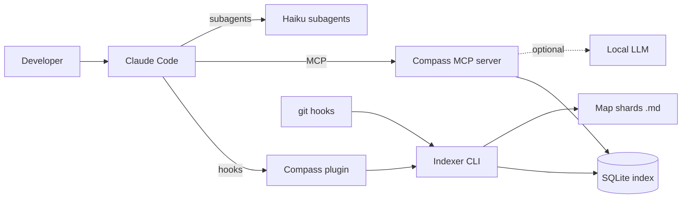

# Compass — Requirements Specification

Sep 23, 2026 · @Uvesh

## Purpose and scope

Compass is a tech-stack-agnostic layer between developers and Claude Code. It raises first-pass output quality and cuts token use by routing each piece of work to the cheapest executor that can do it.

This spec defines what v1 must do. How it is built lives in the companion Architecture & Technical Design doc.

- **Version:** Draft 0.1
- **Working name:** Compass (placeholder, open to change)
- **Delivery form:** a Claude Code plugin (hooks, subagents, skills, commands), plus a local indexer CLI and MCP server
- **Target projects:** any git repository in any language with a tree-sitter grammar or universal-ctags support

## Problem and goals

AI-assisted development today loses time and tokens in five predictable places:

1. **Vague requests.** Prompts without scope or acceptance criteria produce plausible but wrong work, and the rework costs more than the original task.
2. **Implementation before clarity.** The agent starts editing before open questions are answered.
3. **Expensive exploration.** The main model opens whole files and walks folders to find one function.
4. **Stale technology choices.** The model defaults to APIs and patterns from its training data instead of the versions the project actually uses.
5. **Unreviewable output.** Long chat replies and large undifferentiated diffs push reviewers to skim or rubber-stamp.

### Goals

| ID | Goal | v1 target (to be validated) |
| --- | --- | --- |
| G1 | Improve first-pass output quality | 25% fewer follow-up correction prompts per task |
| G2 | Reduce main-model token use | 30% fewer main-model tokens per task |
| G3 | Keep development speed | Task wall-clock time at or below baseline +5% |
| G4 | Make AI output reviewable | A reviewer can find every assumption and judgment call in under 5 minutes |
| G5 | Stay stack-agnostic | Works on the 10 v1 languages with no per-project code |

### Non-goals

- Replacing Claude Code or building a separate agent loop
- Building an IDE extension or GUI in v1
- Training or fine-tuning models
- Supporting projects outside git in v1

## Users and use cases

Compass serves three users. Developers get most of the day-to-day value, while leads and DevEx owners use it to enforce shared standards.

| Persona | What they need from Compass |
| --- | --- |
| Developer | Faster, correct first attempts; short reviewable output; less time re-explaining context |
| Tech lead | Team-wide standards applied consistently; clear evidence of what the AI assumed |
| DevEx / platform owner | Easy install and upgrade; module toggles; token and time metrics to justify the tool |

### Core use cases

| ID | Use case | Compass involvement |
| --- | --- | --- |
| UC-1 | Start a feature task | `/task` template → prompt gate → context pack → spec with open questions → approval → implementation |
| UC-2 | Ask "where is X handled?" | Answered from the code map and query tools, with no file reads |
| UC-3 | Refactor across modules | Import graph finds dependents; spec gate forces scope; test map picks tests |
| UC-4 | Review an AI change | Reviewer opens the change manifest and reads only the Review and Assumption items |
| UC-5 | Onboard to an unfamiliar repo | Folder tree, stack profile and map shards give a structural tour |
| UC-6 | Update team standards | Lead edits the standards skill; every session picks it up next start |
| UC-7 | Digest large output | Logs, test runs and big files go to a Haiku subagent; only a summary returns |

## System context

Compass sits entirely inside Claude Code's extension points and a local process. It never patches or proxies Claude Code itself.

Hooks and git events keep the index fresh; Claude reads it through MCP tools and map shards instead of raw files.

| ID | Component | Responsibility |
| --- | --- | --- |
| C1 | Prompt gate | Checks prompt structure; blocks or warns |
| C2 | Context pack builder | Resolves names in the prompt and injects matching map context |
| C3 | Spec gate | Requires an approved spec before edits on non-trivial tasks |
| C4 | Code map indexer | Parses the repo into symbols, trees and graphs; keeps them current |
| C5 | Query tools | MCP and CLI lookups over the index |
| C6 | Delegation layer | Haiku subagents and local-LLM tools for bulk, low-judgment work |
| C7 | Review output system | Short replies, anchor tags, change manifests |
| C8 | Standards pack | Team rules and actual dependency versions injected per session |
| C9 | Telemetry | Per-task token, time and tool-call metrics |

## Functional requirements

v1 ships every Must item. Should items land if the pilot schedule allows, and Could items are deferred to v1.x unless they come almost free.

### C1 Prompt gate

| ID | Requirement | Priority |
| --- | --- | --- |
| PG-01 | Check each prompt for goal, scope, acceptance criteria and constraints using rules only, with no LLM call | Must |
| PG-02 | On failure, block or warn (per config) and print the missing fields plus the `/task` template | Must |
| PG-03 | Skip checks when the prompt starts with a configurable bypass prefix (default `!quick`); log every bypass | Must |
| PG-04 | Read rules and strictness level (off, warn, block) from `.compass/config.yaml` | Must |
| PG-05 | Provide a `/task` command with fields Goal, Scope, Non-goals, Accept when, Constraints | Must |
| PG-06 | Optionally score prompt clarity with a local model | Could |

### C2 Context pack builder

| ID | Requirement | Priority |
| --- | --- | --- |
| CP-01 | Resolve file paths, directories and symbol names mentioned in the prompt against the index | Must |
| CP-02 | Inject matching map lines, stack profile and related tests within a token budget (default 1,500 tokens) | Must |
| CP-03 | List unresolved names with fuzzy-match suggestions | Should |
| CP-04 | Include recent git hotspots for the touched area | Could |

### C3 Spec gate

| ID | Requirement | Priority |
| --- | --- | --- |
| SG-01 | Classify tasks as small or large using configurable heuristics (files mentioned, keywords such as refactor or migrate) | Should |
| SG-02 | For large tasks, require `.compass/specs/<id>.md` with status draft or approved | Must |
| SG-03 | Spec template includes an Open questions section that Claude must fill before implementing | Must |
| SG-04 | Block Write and Edit tool calls while the active task's spec is not approved | Must |
| SG-05 | `/approve <id>` sets status to approved and records approver and time | Must |

### C4 Code map indexer

| ID | Requirement | Priority |
| --- | --- | --- |
| IX-01 | Enumerate files with `git ls-files`, honouring `.gitignore` and a Compass exclude list | Must |
| IX-02 | Parse with tree-sitter tags queries; fall back to universal-ctags for unsupported languages | Must |
| IX-03 | Extract per symbol: name, kind, parent, signature, start and end line, visibility, doc comment | Must |
| IX-04 | Attach doc comments using the leading-comment rule plus per-language docstring overrides | Must |
| IX-05 | Store the index in SQLite at `.compass/index.db` | Must |
| IX-06 | Generate one Markdown shard per directory plus a root index under `.compass/map/` | Must |
| IX-07 | Re-parse only files whose content hash changed | Must |
| IX-08 | Update on PostToolUse Write/Edit, git post-commit/checkout/merge/rewrite, SessionStart staleness check and `compass index` | Must |
| IX-09 | Build a folder tree with file counts and each folder's purpose from its README or index-file header | Must |
| IX-10 | Detect the stack profile from manifests: languages, frameworks, versions, build, test and lint commands | Must |
| IX-11 | Build an import graph from tree-sitter import queries | Should |
| IX-12 | Map tests to sources by naming convention and imports | Should |
| IX-13 | Index TODO/FIXME markers, env var reads and config keys | Could |
| IX-14 | Compute git churn hotspots | Could |
| IX-15 | Optional file watcher for edits made outside Claude | Could |

### C5 Query tools

| ID | Requirement | Priority |
| --- | --- | --- |
| QT-01 | MCP tools: `find_symbol`, `file_outline`, `read_symbol`, `map`, `stack_profile`, `tests_for` | Must |
| QT-02 | `read_symbol` returns only the symbol's line range plus configurable context lines | Must |
| QT-03 | MCP tools `importers_of` and `callers_of` | Should |
| QT-04 | Every query also available as `compass <cmd> --json` | Must |
| QT-05 | Cap response size and paginate beyond it | Should |

### C6 Delegation layer

| ID | Requirement | Priority |
| --- | --- | --- |
| DL-01 | Ship Haiku subagents: `digest`, `scaffold`, `test-runner` | Must |
| DL-02 | Enforce an output contract per subagent, e.g. digest returns at most 30 lines with file:line refs | Must |
| DL-03 | Ship a CLAUDE.md fragment with delegation rules: delegate when input is large and output is small | Must |
| DL-04 | Local LLM adapter for OpenAI-compatible endpoints (Ollama, llama.cpp, LM Studio), exposed as MCP tools | Should |
| DL-05 | Background enrichment: one-line summaries for undocumented symbols, cached by content hash, marked `~` | Should |
| DL-06 | All local-LLM features degrade silently when no endpoint is reachable | Must |

### C7 Review output system

| ID | Requirement | Priority |
| --- | --- | --- |
| RO-01 | Output style caps chat replies at about 10 lines: summary, manifest link, risks, and no code in chat | Must |
| RO-02 | Anchor tags `@ai:change`, `@ai:assume`, `@ai:review`, `@ai:todo` with task id, in the file's native comment syntax | Must |
| RO-03 | Script generates `.compass/changes/<id>.md` from anchors and git diff, grouped Review vs Mechanical, with file:line links | Must |
| RO-04 | Stop hook fails the turn when touched files lack anchors or the manifest is missing | Should |
| RO-05 | `/accept <id>` strips anchors; a pre-commit hook blocks commits containing `@ai:` tags | Must |

### C8 Standards pack

| ID | Requirement | Priority |
| --- | --- | --- |
| ST-01 | Standards stored as skills per stack, in the repo or a shared org repo | Must |
| ST-02 | SessionStart injects actual dependency versions read from lockfiles | Must |
| ST-03 | Optional docs MCP server for version-matched documentation | Could |

### C9 Telemetry and setup

| ID | Requirement | Priority |
| --- | --- | --- |
| TM-01 | Stop hook records input, output and cache tokens, wall-clock time and tool calls per task | Must |
| TM-02 | Metrics stay local by default; export to a shared store is opt-in | Must |
| TM-03 | `compass report` compares tasks run with Compass on and off | Should |
| CF-01 | Install via the Claude Code plugin marketplace plus one CLI package | Must |
| CF-02 | `compass init` creates `.compass/`, config, git hooks and the first index | Must |
| CF-03 | Every component can be switched off in config | Must |

## Non-functional requirements

Hook latency and fail-open behaviour matter most. A slow or broken hook is felt on every prompt and will get the plugin switched off.

| ID | Area | Requirement | Target |
| --- | --- | --- | --- |
| NF-01 | Latency | Prompt gate p95 on a 100k LOC repo | ≤ 100 ms |
| NF-02 | Latency | Context pack p95 on a 100k LOC repo | ≤ 300 ms |
| NF-03 | Indexing | Full index of a 100k LOC repo | ≤ 60 s |
| NF-04 | Indexing | Incremental update of one file | ≤ 500 ms |
| NF-05 | Map size | Largest map shard; split directories that exceed it | ≤ 2,000 tokens |
| NF-06 | Tokens | Main-model tokens per task vs baseline, on the benchmark suite | −30% |
| NF-07 | Speed | Task wall-clock time vs baseline | ≤ +5% |
| NF-08 | Portability | Runs natively on macOS, Linux and Windows 10+, without WSL | All three in CI |
| NF-09 | Coverage | Languages with full tags queries in v1: TypeScript/JavaScript, Python, Java, Kotlin, Swift, Dart, Go, Rust, C#, C/C++ | 10 |
| NF-10 | Privacy | No code leaves the machine except through Claude Code itself; local-LLM calls stay on localhost | Verified by audit |
| NF-11 | Security | MCP server uses stdio only; hooks never execute code from the repo other than Compass's own scripts | Verified by review |
| NF-12 | Reliability | Any Compass error fails open (Claude Code continues) except deliberate gates; errors go to `.compass/logs/` | 100% of hooks |
| NF-13 | Determinism | Identical input produces byte-identical index and shards, so map diffs are meaningful | Tested in CI |
| NF-14 | Compatibility | Tested against the latest Claude Code release weekly; supported version range documented | Weekly CI job |
| NF-15 | Footprint | Index plus shards for a 100k LOC repo | ≤ 50 MB |
| NF-16 | Hosting | Works with repositories hosted on GitHub and on Azure DevOps (Azure Repos). Anything tied to a hosting service supports both: CI definitions read for the stack profile, links to hosted file or pull-request views, plugin and package distribution, and Compass's own CI | Both covered by tests; Compass CI on GitHub Actions and Azure Pipelines |

## Constraints, assumptions and dependencies

The hard constraint is that Compass may only use Claude Code's public extension points, so every feature must map to a hook, subagent, skill, command, output style or MCP server.

### Constraints

- Hooks are shell commands that receive JSON on stdin and signal through exit codes and stdout/stderr.
- Subagents can only choose Anthropic model tiers (haiku, sonnet, opus, inherit) unless a gateway remaps them.
- Local LLMs are optional; no Must requirement may depend on one.
- Claude Code changes often, so Compass must not rely on undocumented behaviour.

### Assumptions

- Projects use git, hosted on GitHub or Azure DevOps (Azure Repos). Azure DevOps TFVC repositories are not git, so the non-goal above applies to them.
- Developers use the Claude Code CLI or its IDE extensions.
- Developer machines can run Python 3.11+ (or the packaged binary if we ship one).
- Teams are willing to commit a small `.compass/config.yaml` and standards files to each repo.

### Dependencies

| Dependency | Used for | Required |
| --- | --- | --- |
| Claude Code plugin system | Distributing hooks, subagents, skills, commands | Yes |
| tree-sitter + `tree-sitter-language-pack` | Parsing and tags queries | Yes |
| universal-ctags | Fallback parser | No |
| SQLite | Index storage | Yes (bundled with Python) |
| MCP Python SDK | Query tool server | Yes |
| Ollama, llama.cpp or LM Studio | Local-LLM delegation and enrichment | No |

## Acceptance criteria and success metrics

v1 is accepted when every Must requirement passes its test and the pilot shows the token target without a speed regression.

### Release acceptance

- [ ] All Must requirements have an automated test or a documented manual check
- [ ] `compass init` succeeds on 5 reference repos in at least 4 different languages
- [ ] NF-01 to NF-04 latency targets met on the 100k LOC reference repo
- [ ] Disabling Compass entirely restores stock Claude Code behaviour with no leftover hooks
- [ ] Benchmark suite (see Evaluation & Metrics Plan) runs end to end and produces a report

### Success metrics

| Metric | How measured | Target |
| --- | --- | --- |
| Main-model tokens per task | Transcript parsing in the Stop hook | −30% vs baseline |
| Wall-clock time per task | Stop hook timestamps | ≤ +5% vs baseline |
| Correction prompts per task | Count of follow-up prompts before task accepted | −25% vs baseline |
| Review time per change | Self-reported on pilot tasks | −30% vs baseline |
| Gate bypass rate | Bypass log | < 20% of prompts |
| Weekly active pilot users | Telemetry opt-in | ≥ 70% of pilot group after 4 weeks |

## Out of scope, open questions and glossary

### Out of scope for v1

- GUI dashboard (CLI report only)
- Support for other agents such as Cursor or Copilot, although the MCP server should stay agent-neutral so this is possible later
- Hosted or shared index service
- Embedding-based semantic search
- Automatic LLM rewriting of the developer's prompt

### Open questions

- [ ] Final product name
- [ ] Python-only, or port hot paths to Go or Rust for a single binary?
- [ ] Default strictness for the prompt gate: warn or block?
- [ ] Where the org-wide standards pack lives and who owns it
- [ ] Which pilot repos and teams, and what local-LLM hardware they have
- [ ] Is telemetry export acceptable under company data policy?

### Glossary

| Term | Meaning |
| --- | --- |
| Code map | The symbol, tree and graph index built from the repo by scripts |
| Map shard | One Markdown file per directory summarising its symbols for the LLM |
| Context pack | Map lines, stack profile and tests injected alongside a prompt |
| Spec | A short task document with scope, acceptance criteria and open questions, approved before edits |
| Anchor tag | A comment such as `@ai:assume T12` marking an AI change for review |
| Change manifest | Generated file listing every anchored change with file:line links |
| Tier | Executor level: 0 scripts, 1 local LLM, 2 Haiku, 3 main model |
