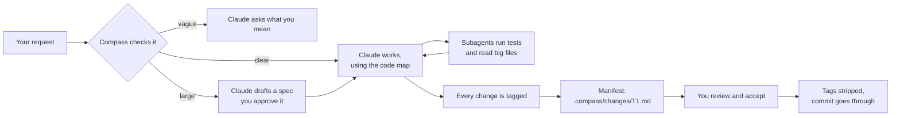

# Compass user guide

You keep working in Claude Code as usual, and Compass works around each request. It gives Claude a map of the code, so Claude looks things up instead of reading whole files. It checks that a request says what to change, where, and how you'll know it's done. It hands heavy reading to cheap Haiku subagents. And at the end of every turn, it writes a manifest of what changed, for you to review.

New here? Start with the [setup guide](setup-guide.md). The ten-minute [demo](#a-ten-minute-demo) at the end shows everything once.

## How Compass saves work

Each piece of work goes to the cheapest thing that can do it correctly:

| Who does it | What it handles | Cost |
| --- | --- | --- |
| Compass itself (scripts) | The code map, lookups, checks, manifests | No tokens |
| A local model (optional) | Summaries of undocumented code, sorting files | No tokens, never waited on |
| Haiku subagents | Test runs, large logs and files, mechanical edits | Cheap tokens |
| Claude (your main model) | Design, logic, judgment | Full price, spent where it matters |

## A task, start to finish



Compass numbers tasks `T1`, `T2`, and so on. A task stays open until you accept it, so it can span several prompts and sessions.

## Ask about the code

Ask the way you normally would: *"Where is retry handled, and what calls it?"* Claude answers from the code map with Compass's tools, instead of opening files one by one:

| Tool | Answers |
| --- | --- |
| `find_symbol` | Where a class, function or method is defined |
| `read_symbol` | Just that definition's lines, not the whole file |
| `file_outline` | What a file defines |
| `map` | The folder tree, or one folder's files and symbols |
| `callers_of` | Where a function is called |
| `importers_of` | Who imports a file or module |
| `tests_for` | Which tests cover a file or symbol |
| `stack_profile` | Languages, frameworks, versions, and the test and build commands |

Every tool has a twin on the command line, so you can see what Claude sees:

```text
$ compass callers-of is_alarm
2 call sites of is_alarm:
src/inventory/api.py:20  in post_reading — return {"alarm": reading.is_alarm()}
tests/test_models.py:5  in test_alarm — assert Reading("s1", 50.0).is_alarm()  [test]
```

The map stays current by itself: through Claude's edits, your own edits, commits, checkouts and rebases.

## Start a task

### Just ask

When a prompt starts new work, Compass checks it for three things: a goal, a scope (files, modules or names), and how to tell it is done. Questions, short replies ("yes, go ahead") and follow-ups inside a task are never checked.

If something is missing, Compass warns you by default and tells Claude to ask before changing code:

```text
You see:     [compass] The request does not state its scope, so Claude will ask.
             /compass:task has every field; a prompt starting with !quick skips the check.
Claude gets: ... ask one short question about each before changing any code:
             scope (the files, modules or symbols involved).
```

With `prompt_gate.strictness: block` in the config, the prompt is refused instead, before it reaches Claude, with a checklist of what to add.

### With `/compass:task`

To state everything at once:

```text
/compass:task Goal: POST /readings should reject a reading with a negative value.
  Scope: src/inventory/api.py.
  Accept when: a negative value gets HTTP 422 and valid readings still get their alarm flag.
  Category: bug fix  Size: S
```

The fields are Goal, Scope, Non-goals, Accept when and Constraints. Category and Size are optional tags that make the [telemetry report](#see-what-compass-saves) compare like with like. The categories are explain, bug fix, feature, refactor, tests and triage; the sizes are S, M and L.

### Skip the checks with `!quick`

Start a prompt with `!quick` to skip the checks for that one turn. Compass logs every bypass, and the gate's rules are tuned from those logs.

### The context pack

Every prompt that names code gets that code's map lines added automatically: the symbol with its file and line, the file's outline, and the tests that cover it. Claude starts in the right place instead of searching. For example, for a request that names `StockItem.restock`:

```text
[compass] From the code map, for the names in this prompt (start here rather than searching):
- `StockItem.restock`: src/inventory/models.py:44-51  method StockItem.restock(self, amount: int) -> None — Add ``amount`` units
- src/inventory/models.py (python, 12 symbols) — Domain models for stock tracking
  ...
Tests: tests/test_models.py (for src/inventory/models.py)
```

## Large tasks need a spec

A task counts as large when it names three or more files, or uses a word like *refactor*, *migrate* or *redesign*. For a large task, Compass writes a spec draft at `.compass/specs/T4.md`. Claude fills in its goal, scope and acceptance, and lists open questions as checkboxes. Until you approve the spec, Claude can edit nothing but it:

```text
[compass] T4's spec is not approved yet, so src/inventory/models.py cannot change.
Finish .compass/specs/T4.md (answer or list its open questions), then ask the
developer to run /compass:approve T4.
```

Read the spec, answer the questions, then approve it:

```text
/compass:approve T4
Approved T4's spec (.compass/specs/T4.md) as Your Name; Claude may now change code for it.
```

Compass records who approved it and when. Claude editing the spec's status approves nothing.

## Review what Claude changed

### Tags in the code

Claude marks each change with a comment in the file's own syntax, on the changed line or the line above it:

| Tag | Means | How closely to read it |
| --- | --- | --- |
| `@ai:review T1` | A judgment call | Read it closely |
| `@ai:assume T1` | An assumption Claude did not verify | Check that it holds |
| `@ai:todo T1` | Something deliberately left undone | Decide what happens to it |
| `@ai:change T1` | A mechanical change: renames, moves, boilerplate | Skim |

### The manifest

At the end of every turn, Compass writes `.compass/changes/T1.md` and shows a one-line summary:

```text
[compass] T1: 1 to review, 1 assumption, 1 todo, 1 mechanical → .compass/changes/T1.md
```

The manifest groups the tags for reading, and each entry links to its line:

```markdown
# Change T1

Branch `main` at `5344690` · 2 files, +15 −1 · 4 anchors

## Review (1)
- [src/inventory/api.py:22](../../src/inventory/api.py#L22) — 422 to match FastAPI's own validation errors

## Assumptions (1)
- [src/inventory/api.py:20](../../src/inventory/api.py#L20) — sensors never send a negative value on purpose; calibration offsets are applied upstream

## TODO (1)
- [tests/test_api.py:8](../../tests/test_api.py#L8) — no test yet for %LEL readings near zero

## Mechanical (1)
- [src/inventory/api.py:3](../../src/inventory/api.py#L3) — import for the 422 below

## Files
| File | Change | + | − | Anchors |
| --- | --- | --- | --- | --- |
| src/inventory/api.py | modified | 4 | 1 | 3 |
| tests/test_api.py | new | 11 | 0 | 1 |
```

If Claude changed a file without tagging it, Compass sends Claude back once to add the tags.

### Accept, then commit

A commit that still contains tags is refused:

```text
compass: commit refused: the staged changes still add 4 AI anchor tags:
  src/inventory/api.py:3  change T1 — import for the 422 below
  src/inventory/api.py:20  assume T1 — sensors never send a negative value on purpose; ...
  src/inventory/api.py:22  review T1 — 422 to match FastAPI's own validation errors
  tests/test_api.py:8  todo T1 — no test yet for %LEL readings near zero
Review them (.compass/changes/T1.md), strip them with /compass:accept in Claude Code
or `compass accept T1`, stage the result and commit again.
```

Once you've reviewed the change, accept it. Compass removes the tags, leaves the code exactly as it was otherwise, and archives the manifest:

```text
/compass:accept T1
Accepted T1: removed 4 anchors from 2 files; manifest archived at .compass/changes/archive/T1.md.
```

Commit as usual. If you truly need to commit with tags still in, `git commit --no-verify` bypasses the check.

### A manifest for the pull request

After the commit, `compass manifest T1 --hosted` prints the manifest with links into GitHub or Azure DevOps, ready to paste into a pull request:

```text
# with a GitHub remote
- [src/inventory/api.py:21](https://github.com/your-org/inventory-demo/blob/main/src/inventory/api.py#L21) — 422 to match FastAPI's own validation errors

# with an Azure Repos remote
- [src/inventory/api.py:21](https://dev.azure.com/your-org/Platform/_git/inventory-demo?path=/src/inventory/api.py&version=GBmain&line=21&…) — 422 to match FastAPI's own validation errors
```

## Let subagents do the heavy reading

Claude hands work that reads a lot but answers briefly to subagents running on Haiku. Only their short answer comes back into your conversation.

| Subagent | Does | Its answer |
| --- | --- | --- |
| `compass:test-runner` | Runs test suites and builds | Only the failures: test, assertion, file:line; at most 20 lines |
| `compass:digest` | Reads logs and large files (over about 500 lines) | At most 30 lines, citing file:line |
| `compass:scaffold` | Makes mechanical edits you can spell out | Changes only the files it was given, and tags each one |

Compass enforces these limits rather than just asking for them. An answer that runs over is sent back once to be rewritten. If `scaffold` tries to edit a file it wasn't given, the edit is refused.

In a real session, Claude was asked to run a suite whose output ran to 623 lines. It handed the run to `compass:test-runner` and got back an 8-line answer naming both failures. The 623 lines never entered the main conversation.

## A local model (optional)

With Ollama or LM Studio on your machine and `local_llm` switched on (see the [setup guide](setup-guide.md#optional-extras)):

- Claude gets `summarize_file` and `classify_files`, answered locally for free.
- After each commit, `compass enrich` writes one-line summaries of undocumented functions and classes into the map, marked with `~`. It runs in the background, so the commit never waits.

Only addresses on this machine are accepted, so code never leaves it. When the model isn't running, these features stay off.

## See what Compass saves

After every turn, Compass records what the turn cost in `.compass/telemetry.jsonl`: tokens per model (cache reads included), tool calls, prompts, active time without your waiting time, and the context Compass itself added. Rows never contain prompts, code or file paths, and they stay on your machine.

`compass report` rolls the rows up into tasks. It compares tasks with Compass on and off, overall and by category. The output below comes from one real session, in which Claude delegated a 600-test run:

```text
$ compass report
Compass telemetry: 1 task (0 with Compass off, 1 on) from 1 file, 2026-09-24 to 2026-09-24
Claude Code 2.1.281

Median per task                  Off (n=0)      On (n=1)    Change
Main-model tokens                        –        79,534         –
  cache reads                            –        62,665         –
Active time                              –           24s         –
Correction prompts                       –             0         –
Read, Grep, Glob calls                   –             2         –
Compass tool calls                       –             0         –
Delegated tokens                         –        40,988         –
Injected by Compass (tokens)             –           472         –
```

The "off" column fills in from a baseline: a stretch of normal work with every module switched off except telemetry. Claude Code then behaves as stock, but every turn is still measured. To set one up, put this in `.compass/config.yaml`:

```yaml
query:        {enabled: false}
prompt_gate:  {enabled: false}
context_pack: {enabled: false}
spec_gate:    {enabled: false}
review:       {enabled: false}
delegation:   {enabled: false}
```

To collect rows from several developers, set `telemetry.export` to a file in a shared folder, or send the pilot owner your `telemetry.jsonl`. `compass report` accepts several files at once. For a controlled comparison, the benchmark harness in `bench/` runs the same tasks with Compass on and off (see `bench/README.md`).

## Settings

Everything lives in `.compass/config.yaml`, and every module can be switched off:

| Section | What it controls | Default |
| --- | --- | --- |
| `query` | The code-map tools, and the rule to use them | on |
| `prompt_gate` | Checking new requests: `strictness` is `off`, `warn` or `block`; `bypass_prefix` | `warn`, `!quick` |
| `context_pack` | Map lines for the names a prompt mentions (`token_budget`) | on, 1500 tokens |
| `spec_gate` | Specs for large tasks (`large_task_when`: file count, keywords) | on, 3 files |
| `review` | Tags, the manifest, the reply limit, the pre-commit check | on, 10-line replies |
| `delegation` | Subagent rules and their enforced limits | on |
| `local_llm` | The optional local model | off |
| `telemetry` | Per-turn measurement; `export` to a file | on, local only |
| `index` | What gets mapped: `exclude` globs, file size limit | lockfiles and `vendor/` excluded |

## Commands

In Claude Code:

| Command | Does |
| --- | --- |
| `/compass:task <brief>` | Starts a task from Goal, Scope, Non-goals, Accept when, Constraints (plus Category and Size) |
| `/compass:approve [task]` | Approves a large task's spec |
| `/compass:accept [task]` | Strips a reviewed task's tags and archives its manifest |

In the terminal (every command takes `-C DIR` to run against another repository):

| Command | Does |
| --- | --- |
| `compass init` | Sets up a repository: config, git hooks, first index |
| `compass index [--full]` | Refreshes the map, or rebuilds it |
| `compass map [DIR]` | The folder tree, or one folder's files and symbols |
| `compass find-symbol NAME` | Where something is defined |
| `compass read-symbol NAME` | One definition's source |
| `compass file-outline PATH` | What a file defines |
| `compass callers-of NAME` | Where a function is called |
| `compass importers-of TARGET` | Who imports a file or module |
| `compass tests-for TARGET` | Tests for a file, folder or symbol |
| `compass stack` | Languages, frameworks, versions, commands |
| `compass task [new]` | The active task, or start a fresh one |
| `compass check-prompt TEXT` | What the checks would do with a prompt, without changing anything |
| `compass manifest [ID] [--hosted]` | Writes a task's manifest; `--hosted` prints GitHub or Azure DevOps links |
| `compass accept [ID]` | Strips a task's tags and archives its manifest |
| `compass check-anchors [ID]` | Lists the tags in the code |
| `compass report [PATHS]` | Tasks with Compass on against off, or a benchmark report |
| `compass enrich` | Local-model summaries now, instead of after the next commit |
| `compass uninstall` | Removes Compass's git hooks from the repository |

## Questions people ask

**Does my code go anywhere new?** No. Compass runs on your machine. Claude Code talks to Anthropic exactly as it always does, the local model is limited to this machine, and telemetry stays in `.compass/`.

**Does it need an API key?** No. Compass is built on Claude Code and your own Claude login.

**Will it slow Claude Code down?** Hardly. On a repository of 100,000 lines, checking a prompt takes about 50 ms, and checking it plus building the context pack about 55 ms. Updating the map after an edit takes well under half a second.

**What if Compass breaks?** It steps aside. Any error inside Compass is logged to `.compass/logs/` and Claude Code carries on as if Compass weren't there. The only things Compass ever stops on purpose are a vague prompt in block mode, edits before a large task's spec is approved, a subagent editing a file it wasn't given, and a commit that still carries tags.

**A check got in my way. What now?** Start the prompt with `!quick` for that one turn, or switch the module off in `config.yaml`.

**Does it work on Windows? On Azure DevOps?** Yes to both. It runs natively on Windows, macOS and Linux, and works with GitHub and Azure Repos alike, hosted links included.

## A ten-minute demo

This walkthrough uses the small inventory service in the Compass repository (`tests/fixtures/python_app`): a warehouse stock and gas-sensor API in Python. Any repository you know well works just as well.

**Before the demo**, make a copy and set it up:

```bash
cp -R /path/to/compass/tests/fixtures/python_app ~/compass-demo
cd ~/compass-demo
git init -b main && git add -A && git commit -m "Inventory service"
compass init
claude
```

On Windows, use `Copy-Item -Recurse` instead of `cp -R`; everything else is the same.

1. **The map.** In a second terminal, run `compass map` and then `compass find-symbol alarm`. *Talking point: Compass has already read the repository, so Claude doesn't have to.*
2. **A question.** Ask Claude: *"Where is a reading judged to be an alarm, and what calls it?"* It answers through `find_symbol` and `callers_of`, with no file reads. *Talking point: lookups cost almost no tokens.*
3. **A vague request.** Type *"improve the error handling"*. Compass flags the missing scope, and Claude asks what you mean instead of guessing. *Talking point: nobody pays for work on the wrong thing.*
4. **A clear task.** Run `/compass:task Goal: POST /readings should reject a reading with a negative value. Scope: src/inventory/api.py. Accept when: a negative value gets HTTP 422 and valid readings still get their alarm flag. Category: bug fix Size: S`. Claude makes the change and tags it.
5. **The review.** Open `.compass/changes/T1.md`. Then run `git add -A && git commit -m "Reject negative readings"`: the commit is refused because tags remain. Run `/compass:accept T1`, and the commit goes through. *Talking point: a reviewer reads four notes, not a diff.*
6. **Delegation.** Ask *"Which tests are failing? Run the suite and tell me."* Claude hands the run to `compass:test-runner` and gets back only the result. (The first run installs the demo's dependencies, so it needs network access.) *Talking point: the test output never enters the main conversation.*
7. **A large task.** Ask *"Refactor src/inventory/models.py: move Reading and Unit into their own module; every import keeps working and the tests still pass."* Compass calls for a spec, Claude drafts it with its open questions, and edits to the code are refused until you run `/compass:approve`. *Talking point: big changes get agreed before they get written.*
8. **The numbers.** Run `compass report` for what the session cost: tokens, time and tool calls, per task. *Talking point: the pilot compares these with a baseline instead of guessing.*
