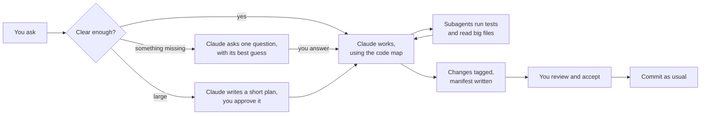

# Compass user guide

Compass makes Claude Code quicker to work with, and its changes quicker to review. You keep working exactly as you do now, with the same prompts and the same commands. Compass works around each request:
- Claude looks code up in a map instead of reading whole files.
- When a new request leaves something important out, Claude checks with you instead of guessing.
- Test runs and big files go to cheap Haiku subagents.
- Every change arrives with a short list of what to review.

Compass never rejects a prompt.

New here? Start with the [setup guide](setup-guide.md). The ten-minute [demo](#a-ten-minute-demo) at the end shows everything once.

## What you get

| When you… | Compass… | Seen in a real session |
| --- | --- | --- |
| Ask where something is | has Claude answer from the code map, not by opening files | *"Where is retry handled, and what calls it?"* was answered with no file reads at all |
| Ask for something vague | has Claude ask one short question, with its best guess, before it writes any code | *"improve the error handling"*: Claude proposed the API routes, and *"Yes, go with your suggestion."* was the whole answer |
| Name code in a prompt | hands Claude that code's map lines and tests along with the prompt | a request naming `src/inventory/models.py` arrived with that file's outline |
| Run tests or read logs | has a Haiku subagent do the reading, so only the result reaches your conversation | 623 lines of test output came back as 8 lines naming both failures |
| Ask for a big change | has Claude write a one-page plan with its open questions first | for a refactor, Claude listed four questions, each with the answer it proposed |
| Review the result | lists the judgment calls, each linked to its line | a four-file change came with three judgment calls to read closely and three mechanical edits to skim |

Each piece of work goes to the cheapest thing that can do it well. Lookups, checks and manifests are plain scripts and cost no tokens. Haiku handles the bulk reading. Your main model is kept for design and judgment.

## Compass stays out of your way

- **Your prompt always goes through.** At most, Claude asks you one question before it starts.
- **No templates.** Write prompts the way you always have. `/compass:task` is there if you like structure, but nothing needs it.
- **Most prompts are never checked.** Questions, replies, follow-ups, requests that change no code ("run the tests", "commit this") and requests that say what they're about all go straight through.
- **One word to skip.** Start a prompt with `!quick` to skip every check for that turn. Every module can be switched off in `.compass/config.yaml`.
- **Fast.** On a repository of 100,000 lines, Compass adds about 35 ms to a prompt, and about 55 ms to a new request it checks and adds context to.
- **It steps aside when it breaks.** Any error inside Compass is logged, and Claude Code carries on as if Compass weren't there.

## A task, start to finish


```mermaid
flowchart LR
  A[You ask] --> B{Clear enough?}
  B -- yes --> E[Claude works,<br/>using the code map]
  B -- something missing --> C[Claude asks one question,<br/>with its best guess]
  C -- you answer --> E
  B -- large --> D[Claude writes a short plan,<br/>you approve it]
  D --> E
  E --> F[Subagents run tests<br/>and read big files]
  F --> E
  E --> G[Changes tagged,<br/>manifest written]
  G --> H[You review and accept]
  H --> I[Commit as usual]
```

Compass numbers tasks `T1`, `T2`, and so on. A task stays open until you accept it, so it can span several prompts and sessions.

## Ask about the code

Ask the way you normally would: *"Where is retry handled, and what calls it?"* Claude answers from the code map with Compass's tools, instead of opening files one by one:

| Tool | Answers |
| --- | --- |
| `find_symbol` | Where a class, function or method is defined |
| `read_symbol` | Just that definition's lines, not the whole file |
| `file_outline` | What a file defines |
| `map` | The folder tree, or one folder's files and symbols |
| `callers_of` | Where a function is called |
| `importers_of` | Who imports a file or module |
| `tests_for` | Which tests cover a file or symbol |
| `stack_profile` | Languages, frameworks, versions, and the test and build commands |

Every tool has a twin on the command line, so you can see what Claude sees:

```text
$ compass callers-of is_alarm
2 call sites of is_alarm:
src/inventory/api.py:20  in post_reading — return {"alarm": reading.is_alarm()}
tests/test_models.py:5  in test_alarm — assert Reading("s1", 50.0).is_alarm()  [test]
```

The map stays current by itself: through Claude's edits, your own edits, commits, checkouts and rebases.

## Start a task

### Just ask

Most requests go straight to work. A new request only gets a question when it leaves out what should change, which code, or what done looks like, and Claude would otherwise have to guess. Your prompt still reaches Claude. Claude asks one short question and offers its best guess, so a word is usually enough. From a real session:

```text
You      improve the error handling

Compass  [compass] Before changing code, Claude will check with you which code this is about.
         (!quick skips this check.)

Claude   Which code do you mean? This is a small repo, so I can make a good guess, but I'd
         like you to confirm before I change anything.
         My guess: the HTTP routes in src/inventory/api.py. That means returning proper 404
         and 422 errors from get_item when a SKU isn't found and from post_reading when a
         reading is bad, rather than letting exceptions bubble up as 500s. […]
         Should I go with the API and models, or did you have something else in mind?

You      Yes, go with your suggestion.
```

Claude then made the change across four files, tagged for review. It found its guess in the code map, without opening a file. A five-second answer replaced reviewing, and perhaps redoing, a change built on the wrong reading of *"error handling"*.

Anything Claude can find out for itself counts as stated:

| Goes straight through | Why |
| --- | --- |
| *"Fix the failing tests"* | the test run says where |
| *"bump fastapi to 0.115"* | names the package and the version |
| *"Update the README to mention Windows support"* | names the file and the change |
| *"Make POST /readings reject a negative value with HTTP 422"* | names the endpoint and the behaviour |
| *"Run the tests and tell me what fails."* | changes no code |
| *"fix it"*, in a conversation already under way | "it" is what you were just discussing |

| Claude checks with you first | What's open |
| --- | --- |
| *"improve the error handling"* | which code |
| *"make it faster"*, as the first thing in a session | which code, and how much faster |
| *"add some tests"* | for which code |

Only the first request of a task is ever checked. Your answer, and everything after it, goes straight through. To see what Compass would do with any prompt, without changing anything, run `compass check-prompt "…"`.

### Strict mode, for a guarantee

In every real session so far, Claude asked when Compass told it to. If your team wants that guaranteed, set `prompt_gate.strictness: strict`. Claude asks in the same way, and Compass also holds file edits until you reply. The prompt still goes through, and any reply releases the hold.

### `/compass:task`, if you like structure

To state everything up front:

```text
/compass:task Goal: POST /readings should reject a reading with a negative value.
  Scope: src/inventory/api.py.
  Accept when: a negative value gets HTTP 422 and valid readings still get their alarm flag.
  Category: bug fix  Size: S
```

The fields are Goal, Scope, Non-goals, Accept when and Constraints. Category and Size are optional tags that make the [telemetry report](#see-what-compass-saves) compare like with like. The categories are explain, bug fix, feature, refactor, tests and triage; the sizes are S, M and L.

### `!quick`

Start a prompt with `!quick` to skip the checks for that one turn. Compass logs each use, so the rules can be tuned wherever they get in the way.

### The context pack

Every prompt that names code gets that code's map lines added automatically: the symbol with its file and line, the file's outline, and the tests that cover it. Claude starts in the right place instead of searching. For example, for a request that names `StockItem.restock`:

```text
[compass] From the code map, for the names in this prompt (start here rather than searching):
- `StockItem.restock`: src/inventory/models.py:44-51  method StockItem.restock(self, amount: int) -> None — Add ``amount`` units
- src/inventory/models.py (python, 12 symbols) — Domain models for stock tracking
  ...
Tests: tests/test_models.py (for src/inventory/models.py)
```

## Large tasks start with a plan

A task counts as large when it names three or more files, or uses a word like *refactor*, *migrate* or *redesign*. A request about one function doesn't count: *"Refactor `parse_config` to return a dataclass"* just goes ahead. For a large task, Claude first writes a short plan at `.compass/specs/T2.md`: goal, scope, what's out of scope, how to tell it's done, and its open questions, each with the answer it proposes. It then waits for you. It works like plan mode, except the plan is a file you can review, share and commit. From a real refactor:

```markdown
- [ ] Q1: What should the new module be called? Proposed name: `src/inventory/readings.py`.
- [ ] Q2: Should `DEFAULT_THRESHOLD` move to the new module and be re-exported
      from `models`? That's the proposal. The alternative is to leave it in
      `models` and have `readings` import it, which risks a circular import.
- [ ] Q3: Should `__init__.py` and `api.py` switch to importing `Reading` from
      the new module, or stay untouched? Proposed: stay untouched, because the
      request is only to keep them working.
```

Answer the questions in the conversation, or just accept the proposals, then approve:

```text
/compass:approve T2
Approved T2's spec (.compass/specs/T2.md) as Your Name; Claude may now change code for it.
```

Claude then implements the plan. Compass records who approved it and when, and holds code edits until then, so a change across many files can't start from a misunderstanding. `!quick` skips the plan for one turn, and `spec_gate.large_task_when` in the config sets what counts as large.

## Review what Claude changed

### Tags in the code

Claude marks each change with a comment in the file's own syntax, on the changed line or the line above it:

| Tag | Means | How closely to read it |
| --- | --- | --- |
| `@ai:review T1` | A judgment call | Read it closely |
| `@ai:assume T1` | An assumption Claude did not verify | Check that it holds |
| `@ai:todo T1` | Something deliberately left undone | Decide what happens to it |
| `@ai:change T1` | A mechanical change: renames, moves, boilerplate | Skim |

### The manifest

At the end of every turn, Compass writes `.compass/changes/T1.md` and shows a one-line summary. This one comes from the session above, after *"improve the error handling"* and *"Yes, go with your suggestion."*:

```text
[compass] T1: 3 to review, 3 mechanical → .compass/changes/T1.md
```

```markdown
# Change T1

Branch `main` at `7ff1bd3` · 4 files, +67 −6 · 6 anchors

## Review (3)
- [src/inventory/api.py:16](../../src/inventory/api.py#L16) — unknown SKUs now 404 instead of returning a fabricated zero-stock item; nothing populates `registry` yet, so this 404s for every SKU until something does
- [src/inventory/api.py:26](../../src/inventory/api.py#L26) — pydantic accepts NaN/inf floats by default; NaN would compare False and silently suppress an alarm, so reject non-finite values
- [src/inventory/models.py:75](../../src/inventory/models.py#L75) — previously merged mismatched SKUs silently under a.sku

## Mechanical (3)
- [src/inventory/models.py:49](../../src/inventory/models.py#L49) — message said "positive" but zero is accepted; include the offending value
- [tests/test_api.py:1](../../tests/test_api.py#L1) — tests for the new API error responses
- [tests/test_models.py:16](../../tests/test_models.py#L16) — cover the new validation errors

## Files
| File | Change | + | − | Anchors |
| --- | --- | --- | --- | --- |
| src/inventory/api.py | modified | 12 | 3 | 2 |
| src/inventory/models.py | modified | 9 | 2 | 2 |
| tests/test_api.py | new | 32 | 0 | 1 |
| tests/test_models.py | modified | 14 | 1 | 1 |
```

The reviewer starts with the three judgment calls, one of which changes behaviour for every SKU, instead of hunting for them in 73 lines of diff. If Claude changes a file without tagging it, Compass sends Claude back once to add the tags.

### Accept, then commit

Once you've reviewed the change, accept it. Compass removes the tags, leaves the code exactly as it was otherwise, and archives the manifest:

```text
/compass:accept T1
Accepted T1: removed 6 anchors from 4 files; manifest archived at .compass/changes/archive/T1.md.
```

Then commit as usual. If you commit before accepting, the pre-commit hook stops that commit and lists the tags, so they never reach your history. Accept, and commit again. (`git commit --no-verify` commits as is.)

### A manifest for the pull request

After the commit, `compass manifest T1 --hosted` prints the manifest with links into GitHub or Azure DevOps, ready to paste into a pull request:

```text
# with a GitHub remote
- [src/inventory/api.py:16](https://github.com/your-org/inventory-demo/blob/main/src/inventory/api.py#L16) — unknown SKUs now 404 instead of returning a fabricated zero-stock item; …

# with an Azure Repos remote
- [src/inventory/api.py:16](https://dev.azure.com/your-org/Platform/_git/inventory-demo?path=/src/inventory/api.py&version=GBmain&line=16&…) — unknown SKUs now 404 instead of returning a fabricated zero-stock item; …
```

## Let subagents do the heavy reading

Claude hands work that reads a lot but answers briefly to subagents running on Haiku. Only their short answer comes back into your conversation, which keeps it short, fast and cheap.

| Subagent | Does | Its answer |
| --- | --- | --- |
| `compass:test-runner` | Runs test suites and builds | Only the failures: test, assertion, file:line; at most 20 lines |
| `compass:digest` | Reads logs and large files (over about 500 lines) | At most 30 lines, citing file:line |
| `compass:scaffold` | Makes mechanical edits you can spell out | Changes only the files it was given, and tags each one |

Compass holds each subagent to its limit. An answer that runs over goes back once to be shortened, and `scaffold` can only edit the files it was given.

In a real session, Claude was asked to run a suite whose output ran to 623 lines. It handed the run to `compass:test-runner` and got back an 8-line answer naming both failures. The 623 lines never entered the main conversation.

## A local model (optional)

With Ollama or LM Studio on your machine and `local_llm` switched on (see the [setup guide](setup-guide.md#optional-extras)):

- Claude gets `summarize_file` and `classify_files`, answered locally for free.
- After each commit, `compass enrich` writes one-line summaries of undocumented functions and classes into the map, marked with `~`. It runs in the background, so the commit never waits.

Only addresses on this machine are accepted, so code never leaves it. When the model isn't running, these features stay off.

## See what Compass saves

After every turn, Compass records what the turn cost in `.compass/telemetry.jsonl`. That covers tokens per model (cache reads included), tool calls, prompts, and active time without your waiting time. It also covers the context Compass itself added. Rows never contain prompts, code or file paths, and they stay on your machine.

`compass report` rolls the rows up into tasks. It compares tasks with Compass on and off, overall and by category. Here it is for the session above:

```text
$ compass report
Compass telemetry: 1 task (0 with Compass off, 1 on) from 1 file, 2026-09-24 to 2026-09-24
Claude Code 2.1.281

Median per task                   Off (n=0)      On (n=1)    Change
Main-model tokens                         –       397,840         –
  cache reads                             –       368,052         –
Active time                               –        1m 07s         –
Correction prompts                        –             0         –
Answers to Claude's questions             –             1         –
Read, Grep, Glob calls                    –             2         –
Compass tool calls                        –             5         –
Delegated tokens                          –        19,101         –
Injected by Compass (tokens)              –           552         –

Prompt gate: 2 prompts, 0 with !quick (0.0%; the target is under 20%), 1 where Claude checked with the developer first
```

Answers to Claude's questions are counted on their own, not as corrections. They are the price of the question: one short reply at the start instead of rework at the end.

The "off" column fills in from a baseline: a stretch of normal work with every module switched off except telemetry. Claude Code then behaves as stock, but every turn is still measured. To set one up, put this in `.compass/config.yaml`:

```yaml
query:        {enabled: false}
prompt_gate:  {enabled: false}
context_pack: {enabled: false}
spec_gate:    {enabled: false}
review:       {enabled: false}
delegation:   {enabled: false}
```

To collect rows from several developers, set `telemetry.export` to a file in a shared folder, or send the pilot owner your `telemetry.jsonl`. `compass report` accepts several files at once. For a controlled comparison, the benchmark harness in `bench/` runs the same tasks with Compass on and off (see `bench/README.md`).

## Settings

Everything lives in `.compass/config.yaml`, and every module can be switched off:

| Section | What it controls | Default |
| --- | --- | --- |
| `query` | The code-map tools, and the rule to use them | on |
| `prompt_gate` | Whether Claude checks with you when a new request leaves something out: `strictness` is `ask`, `strict` (edits also wait for your answer) or `off`; `bypass_prefix` | `ask`, `!quick` |
| `context_pack` | Map lines for the names a prompt mentions (`token_budget`) | on, 1500 tokens |
| `spec_gate` | A plan first for large tasks (`large_task_when`: file count, keywords) | on, 3 files |
| `review` | Tags, the manifest, the reply limit, the pre-commit check | on, 10-line replies |
| `delegation` | Subagent rules and their limits | on |
| `local_llm` | The optional local model | off |
| `telemetry` | Per-turn measurement; `export` to a file | on, local only |
| `index` | What gets mapped: `exclude` globs, file size limit | lockfiles and `vendor/` excluded |

## Commands

In Claude Code:

| Command | Does |
| --- | --- |
| `/compass:task <brief>` | Starts a task from Goal, Scope, Non-goals, Accept when, Constraints (plus Category and Size); optional |
| `/compass:approve [task]` | Approves a large task's plan |
| `/compass:accept [task]` | Strips a reviewed task's tags and archives its manifest |

In the terminal (every command takes `-C DIR` to run against another repository):

| Command | Does |
| --- | --- |
| `compass init` | Sets up a repository: config, git hooks, first index |
| `compass index [--full]` | Refreshes the map, or rebuilds it |
| `compass map [DIR]` | The folder tree, or one folder's files and symbols |
| `compass find-symbol NAME` | Where something is defined |
| `compass read-symbol NAME` | One definition's source |
| `compass file-outline PATH` | What a file defines |
| `compass callers-of NAME` | Where a function is called |
| `compass importers-of TARGET` | Who imports a file or module |
| `compass tests-for TARGET` | Tests for a file, folder or symbol |
| `compass stack` | Languages, frameworks, versions, commands |
| `compass task [new]` | The active task, or start a fresh one |
| `compass check-prompt TEXT` | What Compass would do with a prompt, without changing anything |
| `compass manifest [ID] [--hosted]` | Writes a task's manifest; `--hosted` prints GitHub or Azure DevOps links |
| `compass accept [ID]` | Strips a task's tags and archives its manifest |
| `compass check-anchors [ID]` | Lists the tags in the code |
| `compass report [PATHS]` | Tasks with Compass on against off, or a benchmark report |
| `compass enrich` | Local-model summaries now, instead of after the next commit |
| `compass uninstall` | Removes Compass's git hooks from the repository |

## Questions people ask

**Will Compass ever reject my prompt?** No. Every prompt reaches Claude. When a new request leaves something important out, Compass asks Claude to check with you first, and that is all it does.

**Won't the questions get annoying?** Compass only looks at the first request of a task. It asks only when Claude would otherwise have to guess, and anything Claude can find on its own counts as stated. Claude's question comes with a best guess, so "yes" is often the whole answer. Compass's tests hold a list of realistic requests: the vague ones must get a question, and the clear ones must not. If a question does get in your way, start the prompt with `!quick`. Every decision is logged in `.compass/logs/gate.jsonl`, so the rules get tuned from what actually happens.

**Will it slow Claude Code down?** Hardly. On a repository of 100,000 lines, a prompt takes about 35 ms longer, and a new request that gets checked and a context pack about 55 ms. Updating the map after an edit takes well under half a second.

**What does Compass hold back, and why?**
- Code edits on a large task, until you approve its plan.
- Code edits in strict mode, until you've answered Claude's question.
- Edits by the `scaffold` subagent to files it wasn't given.
- A commit that still carries review tags.

Each is there so that the work you get is the work you asked for. `!quick` lifts the first two for a turn.

**Does my code go anywhere new?** No. Compass runs on your machine. Claude Code talks to Anthropic exactly as it always does, the local model is limited to this machine, and telemetry stays in `.compass/`.

**Does it need an API key?** No. Compass is built on Claude Code and your own Claude login.

**What if Compass breaks?** It steps aside. Any error inside Compass is logged to `.compass/logs/`, and Claude Code carries on as if Compass weren't there.

**Does it work on Windows? On Azure DevOps?** Yes to both. It runs natively on Windows, macOS and Linux, and works with GitHub and Azure Repos alike, hosted links included.

## A ten-minute demo

This walkthrough uses the small inventory service in the Compass repository (`tests/fixtures/python_app`): a warehouse stock and gas-sensor API in Python. Every sample in this guide comes from it. Any repository you know well works just as well.

**Before the demo**, make a copy and set it up:

```bash
cp -R /path/to/compass/tests/fixtures/python_app ~/compass-demo
cd ~/compass-demo
git init -b main && git add -A && git commit -m "Inventory service"
compass init
claude
```

On Windows, use `Copy-Item -Recurse` instead of `cp -R`; everything else is the same.

1. **The map.** In a second terminal, run `compass map` and then `compass find-symbol alarm`. *Say: Compass has already read the repository, so Claude doesn't have to.*
2. **A question.** Ask Claude: *"Where is a reading judged to be an alarm, and what calls it?"* It answers through `find_symbol` and `callers_of`, with no file reads. *Say: lookups like this cost a fraction of reading the files.*
3. **A vague request.** Type *"improve the error handling"*. Claude looks at the map and asks which code you mean, with its best guess. Reply *"Yes, go with your suggestion."* and Claude makes the change. *Say: a five-second answer instead of reviewing a guess.*
4. **The review.** Open `.compass/changes/T1.md`: a few judgment calls to read, the rest to skim. Run `/compass:accept T1`, then commit as usual. *Say: the reviewer knows exactly where to look.*
5. **Tests.** Ask *"Run the tests and tell me what fails."* Claude hands the run to `compass:test-runner` and gets back only the result. (The first run installs the demo's dependencies, so it needs network access.) *Say: the test output never fills the conversation.*
6. **A large task.** Ask *"Refactor src/inventory/models.py: move Reading and Unit into their own module; every import keeps working and the tests still pass."* Claude writes a plan with its questions and proposed answers. Accept them, run `/compass:approve T2`, and Claude implements the plan. *Say: big changes get agreed before they get written.*
7. **The numbers.** Run `compass report` for what the session cost: tokens, time, tool calls, and answers to Claude's questions, per task. *Say: the pilot compares these with a baseline instead of guessing.*
8. **Optional: what gets through.** Run `compass check-prompt "Fix the failing tests"` and `compass check-prompt "improve the error handling"`. *Say: only requests Claude would have to guess at get a question.*
